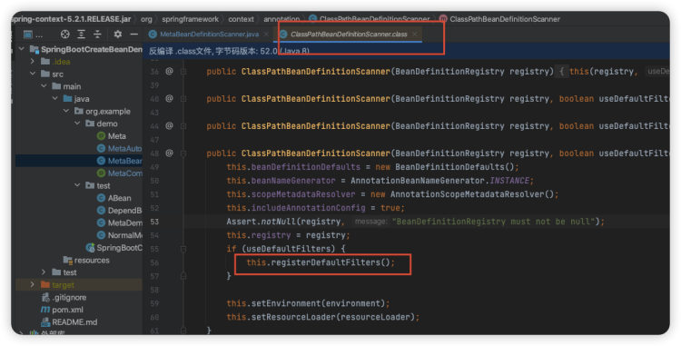
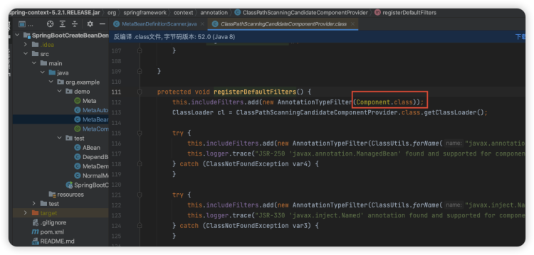
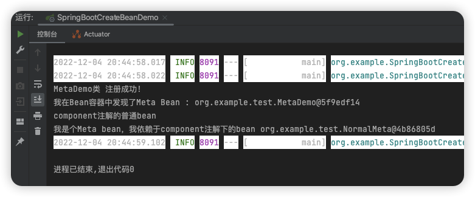

# 简介
在进行web开发的时候，我们经常使用@Component、@Services、@Controller等注解去声明Bean，然后Spring就会帮我们注册。
如果我们想要自己写一个组件（方便后期使用），进行无感引入的时候，就需要自己去注册Bean，所以实现自写组件第一步，先整个Bean注册器。

# 定义元注解
这里的元注解的意思就是类似于Controller、Service这样的注解，直接在类上加入，Spring就会帮我们自动创建。
```java
@Target({ElementType.TYPE})
@Retention(RetentionPolicy.RUNTIME)
@Documented
public @interface Meta {
        /**
* 元注解：类似于Component
*/
    }
```
# 定义扫描注解
定义完元注解后，我们还需要定义一个扫描注解，告诉Spring我要扫描哪些包里面的类。就像MapperScan一样，你里面可以没有值，但是你得加上这个注解。
```java
@Target({ElementType.TYPE})
@Retention(RetentionPolicy.RUNTIME)
@Documented
@Import({MetaAutoConfigureRegistrar.class})
public @interface MetaComponentScan {

    /**
     * 当指定了值的时候，主要加载这些包路径下，包含@Meta注解的类；
     * 如果全是默认值（即为空），则扫描这个注解所在类对应的包路径下所有包含@Meta的类
     * @return
     */
    @AliasFor("basePackages") String[] value() default {};

    @AliasFor("value") String[] basePackages() default {};

    Class<?>[] basePackageClasses() default {};
}
```
# 扫描类
元注解，扫描注解现在都有了。现在还需要一个扫描类，这个类的作用就是过滤类，如果类上面有元注解，那么就把类拦下来。具体怎么实现的呢？

使用ClassPathBeanDefinitionScanner类：



可以看到他原来的scanner的构造方法中有个注册默认过滤器方法registerDefaultFilters



可以看到Component注解的过滤就是在此生效的，没看到Service等注解，可能是因为这是Spring的jar包，这个没深入了解，以后再研究。
可以看到Spring原生的就是一个ClassPathScanningCandidateComponentProvider类，然后设置扫描的注解，就可以过滤出相应的类。我们按照这个逻辑去仿写。
:::
首先继承ClassPathScanningCandidateComponentProvider，仿照他的构造函数全CV一遍。
因为它的构造方法中只有四个参数的那个有注册过滤器方法，所以我们就写这一个。
```java

/**
 * 扫描类
 */
public class MetaBeanDefinitionScanner extends ClassPathBeanDefinitionScanner {
    /**
     * 仿照原生的构造方法全部来一遍
     * @param registry Bean定义注册中心
     * @param useDefaultFilters 是否使用用户默认的filter
     * @param environment 整个spring应用运行时的环境信息：类似于application.yml 里面就是。
     * @param resourceLoader 对资源封装的加载器：可以从文件中、网络中、流中加载资源。
     *                       资源加载器是个接口，默认从类路径下加载。
     *                       通过getResource方法从字符串中查找路径。
     *                       可以从容器中获取ResourceLoader，调用getResource方法。
     */
    public MetaBeanDefinitionScanner(BeanDefinitionRegistry registry, boolean useDefaultFilters,
                                     Environment environment, ResourceLoader resourceLoader) {
        super(registry, useDefaultFilters, environment, resourceLoader);
        registerFilters();
    }

    /**
     * 注册过滤器  在此类的构造函数中引用
     */
    protected void registerFilters() {
        //注册一个AnnotationTypeFilter，确保过滤获取所有@Meta注解的类
        addIncludeFilter(new AnnotationTypeFilter(Meta.class));
    }
}

```
# Bean自动注册类
相关的准备工作完成了，就可以进行完成自动注册类了。
自动注册类我们需要实现三个接口。

ImportBeanDefinitionRegistrar接口：
会执行ImportBeanDefinitionRegistrar的registerBeanDefinitions方法，然后生成BeanDefinition对象，并最终注册到BeanDefinitionRegistry中，为后续实例化bean做准备。
ResourceLoaderAware接口：
获取资源加载器,可以获得外部资源文件。在Java类中可以通过文件流等的形式加载外部资源文件，并能读取资源文件中的配置，通过下面的get属性可以获取Properties中的配置属性。

```java
//TestBean必须实现ResourceLoaderAware接口，才能加载资源
public static void main(String[] args)
  {
    // 创建ApplicationContext容器
    ApplicationContext ctx = new
      ClassPathXmlApplicationContext("beans.xml");
    // 获取容器中名为test的Bean实例
    TestBean tb = ctx.getBean("test" , TestBean.class);
    // 通过tb实例来获取ResourceLoader对象
    ResourceLoader rl = tb.getResourceLoader();
    // 判断程序获得ResourceLoader和容器是否相同
    System.out.println(rl == ctx);
  }
```

EnvironmentAware接口：
凡注册到Spring容器内的bean，实现了EnvironmentAware接口重写setEnvironment方法后，在工程启动时可以获得application.properties的配置文件配置的属性值。


```java
 @Configuration
 public class MyProjectc implements EnvironmentAware {
    @Override
    public void setEnvironment(Environment environment) {
            String projectName = environment.getProperty("project.name");
            System.out.println(projectName);
    }
 }  
```
然后这是最终自动注册类代码，必要注释已经写进去了。
```java
package org.example.demo;

import org.springframework.beans.factory.support.BeanDefinitionRegistry;
import org.springframework.context.EnvironmentAware;
import org.springframework.context.ResourceLoaderAware;
import org.springframework.context.annotation.ClassPathBeanDefinitionScanner;
import org.springframework.context.annotation.ImportBeanDefinitionRegistrar;
import org.springframework.core.annotation.AnnotationAttributes;
import org.springframework.core.env.Environment;
import org.springframework.core.io.ResourceLoader;
import org.springframework.core.type.AnnotationMetadata;
import org.springframework.core.type.filter.AnnotationTypeFilter;
import org.springframework.util.ClassUtils;

import java.util.Arrays;
import java.util.LinkedHashSet;
import java.util.Set;

/**
 * 核心类
 * 流程就是：因为我们这里的目标是注册所有带 @Meta 注解的类，
 * 扫描所有的类，判断是否有@Meta注解，有则通过 registry 手动注册
 */

public class MetaAutoConfigureRegistrar
        implements ImportBeanDefinitionRegistrar, ResourceLoaderAware, EnvironmentAware {

    /**
     *
     */
    private ResourceLoader resourceLoader;

    private Environment environment;

    /**
     * 实现ResourceLoaderAware接口方法，可以获得外部资源xml、txt等。
     * @param resourceLoader
     */
    @Override
    public void setResourceLoader(ResourceLoader resourceLoader) {
        this.resourceLoader = resourceLoader;
    }

    /**
     * 实现EnvironmentAware接口方法，此属性可以获得application.properties中的属性值
     * @param environment
     */
    @Override
    public void setEnvironment(Environment environment) {
        this.environment = environment;
    }

    /**
     * 核心！！注册bean
     * @param importingClassMetadata 注解元数据，多半是用来获取注解的属性
     * @param registry bean 定义注册器
     */
    @Override
    public void registerBeanDefinitions(AnnotationMetadata importingClassMetadata, BeanDefinitionRegistry registry) {
        //新建一个元注解扫描类，过滤出来要进行新建的Bean
        MetaBeanDefinitionScanner scanner =
                new MetaBeanDefinitionScanner(registry, true, this.environment, this.resourceLoader);
        //设置扫描包路径
        Set<String> packagesToScan = this.getPackagesToScan(importingClassMetadata);
        //根据扫描包路径，元注解扫描类去扫描对应的包，过滤出对应的类
        //找到以后就会注册到Bean容器中，当然我们的代码到这里就结束了，再向下的步骤就是Spring自己干了
        scanner.scan(packagesToScan.toArray(new String[]{}));
    }

    /**
     * 找到要扫描的包路径，set存储
     * @param metadata 注解元数据
     * @return
     */
    private Set<String> getPackagesToScan(AnnotationMetadata metadata) {
        //获取使用元数据扫描注解的类的注解属性值
        AnnotationAttributes attributes =
                AnnotationAttributes.fromMap(metadata.getAnnotationAttributes(MetaComponentScan.class.getName()));
        //取出注解中的basePackages值
        String[] basePackages = attributes.getStringArray("basePackages");
        //取出注解中的basePackageClasses值
        Class<?>[] basePackageClasses = attributes.getClassArray("basePackageClasses");
        //新建双向链表存储 包扫描路径
        Set<String> packagesToScan = new LinkedHashSet<>(Arrays.asList(basePackages));
        for (Class clz : basePackageClasses) {
            //添加扫描路径
            packagesToScan.add(ClassUtils.getPackageName(clz));
        }

        if (packagesToScan.isEmpty()) {
            //如果到这里包扫描路径为空，说明使用MetaComponentScan注解的时候没有设定值
            //那么就按照这个注解使用地的包路径作为扫描路径
            packagesToScan.add(ClassUtils.getPackageName(metadata.getClassName()));
        }
        // 返回包路径
        return packagesToScan;
    }
}
```
# 测试
完成代码后，开始写测试了。测试类的思路也很简单，就是整一个SpringApplication，上面加上元注解扫描注解，然后整四个普通类，对照实验加上注解。在这四个类的构造函数中，输出string，这样就可以看出来顺序和是否实现注解了。
下面是四个类
```java
@Meta
public class MetaDemo {
    public  MetaDemo() {
        System.out.println("MetaDemo类 注册成功!");
    }
}
```
```java
@Component
public class NormalMeta {
    public NormalMeta() {
        System.out.println("component注解的普通bean");
    }
}

```
```java
@Meta
public class DependBean {
    public DependBean(NormalMeta normalBean) {
        System.out.println("我是个Meta bean，我依赖于component注解下的bean " + normalBean);
    }
}
```
```java
@Component
public class ABean {
    /**
     * 这里的构造函数用到MetaDemo，你的IDE可能会报错，因为无法自动装配
     * 因为Component等注解IDEA已经知道了，我们自定义的注解他还不认识，所以报错
     * 这里如果ABean也能成功构造，说明Bean已经注册成功了。
     * @param metaDemo
     */
    public ABean(MetaDemo metaDemo) {
        System.out.println("我在Bean容器中发现了Meta Bean : " + metaDemo);
    }
}
```
Main主类
```java
@SpringBootApplication
@MetaComponentScan
public class SpringBootCreateBeanDemo {
    public static void main(String[] args) {
        SpringApplication.run(SpringBootCreateBeanDemo.class, args);
    }
}
```
输出结果

可以看到顺序，单纯的使用元注解Meta的类先注册，然后Component注解注册，最后才是依赖于普通类的Meta类。至于为什么自定义的先注册这个我还没有搞懂顺序。
至此结束。
